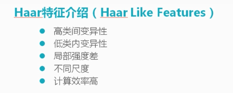
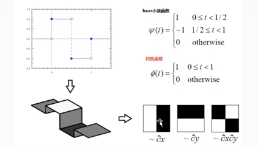
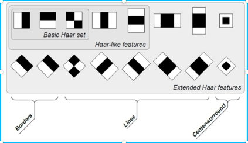
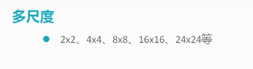
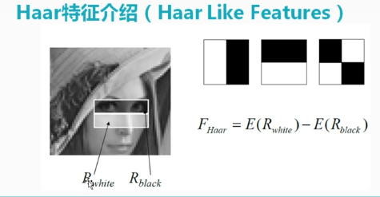
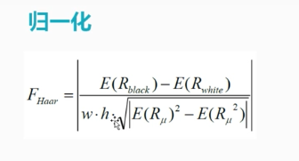
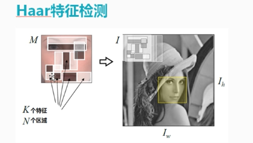

# Haar特征

## 1 简介

- 函数

- 扩展

**当有了这些扩展以后,要考虑三个不变性,尺度不变性,旋转不变性和光照不变性,这三个不变性是衡量这个算法能否使用的标准.**

通过以上其实在运算过程中需要很大的计算量的,但是如何运用积分图,就能够减小计算量.

- 多尺度

多尺度之后会得到更多的数据,一般还需要进行光照影响的消除.

​                                                   

归一化之后就可以取做匹配或者检测等等.

## 2 特征检测

这里的检测是没有考虑到尺度不变性和旋转不变性的,一般进行检测的时候需要考虑这两个问题.