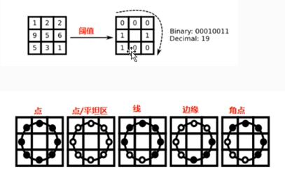
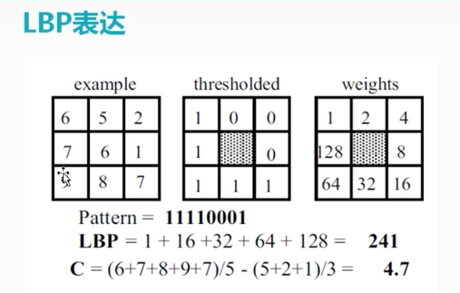
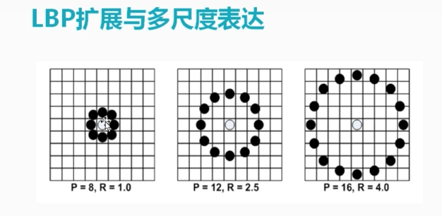
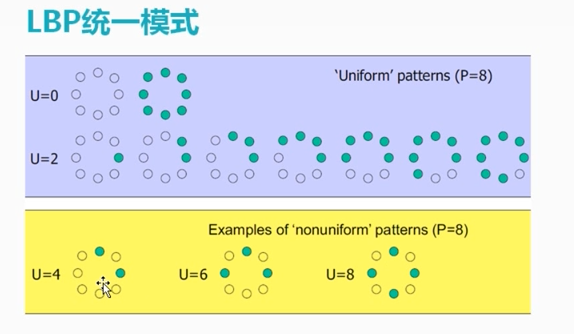

# LBP(Local Binary Patterns)特征

这个特征在很多领域都用到,应用很广泛.

## 1 简介



通过局部特征就可以检测,通过以上第一个图的得到局部二值化特征之后,就可以根据特征,判断是什么类型的特征.

### 1.1 LBP表达







所有不是前面两者的都叫做非同一模式.


通过使用统一的模式,维度下降了,运算速度得到提高.

## 2 代码演示

```
#include <opencv2/opencv.hpp>
#include <iostream>
#include "math.h"

using namespace cv;
using namespace std;

Mat src, gray_src;
int current_radius = 3;
int max_count = 20;
void ELBP_Demo(int, void*);
int main(int argc, char** argv) {
        src = imread("D:/vcprojects/images/test.png");
        if (src.empty()) {
                printf("could not load image...\n");
                return -1;
        }
        const char* output_tt = "LBP Result";
        namedWindow("input image", CV_WINDOW_AUTOSIZE);
        namedWindow(output_tt, CV_WINDOW_AUTOSIZE);
        imshow("input image", src);

        // convert to gray
        cvtColor(src, gray_src, COLOR_BGR2GRAY);
        int width = gray_src.cols;
        int height = gray_src.rows;

        // »ù±¾LBPÑÝʾ
        Mat lbpImage = Mat::zeros(gray_src.rows - 2, gray_src.cols - 2, CV_8UC1);
        for (int row = 1; row < height - 1; row++) {
                for (int col = 1; col < width - 1; col++) {
                        uchar c = gray_src.at<uchar>(row, col);
                        uchar code = 0;
                        code |= (gray_src.at<uchar>(row - 1, col - 1) > c) << 7;
                        code |= (gray_src.at<uchar>(row - 1, col) > c) << 6;
                        code |= (gray_src.at<uchar>(row - 1, col + 1) > c) << 5;
                        code |= (gray_src.at<uchar>(row, col + 1) > c) << 4;
                        code |= (gray_src.at<uchar>(row + 1, col + 1) > c) << 3;
                        code |= (gray_src.at<uchar>(row + 1, col) > c) << 2;
                        code |= (gray_src.at<uchar>(row + 1, col - 1) > c) << 1;
                        code |= (gray_src.at<uchar>(row, col - 1) > c) << 0;
                        lbpImage.at<uchar>(row - 1, col - 1) = code;
                }
        }
        imshow(output_tt, lbpImage);

        // ELBP ÑÝʾ
        namedWindow("ELBP Result", CV_WINDOW_AUTOSIZE);
        createTrackbar("ELBP Radius:", "ELBP Result", &current_radius, max_count, ELBP_Demo);
        ELBP_Demo(0, 0);

        waitKey(0);
        return 0;
}
void ELBP_Demo(int, void*) {
        int offset = current_radius * 2;
        Mat elbpImage = Mat::zeros(gray_src.rows - offset, gray_src.cols - offset, CV_8UC1);
        int width = gray_src.cols;
        int height = gray_src.rows;

        int numNeighbors = 8;
        for (int n = 0; n < numNeighbors; n++) {
                float x = static_cast<float>(current_radius) * cos(2.0 * CV_PI*n / static_cast<float>(numNeighbors));
                float y = static_cast<float>(current_radius) * -sin(2.0 * CV_PI*n / static_cast<float>(numNeighbors));

                int fx = static_cast<int>(floor(x));
                int fy = static_cast<int>(floor(y));
                int cx = static_cast<int>(ceil(x));
                int cy = static_cast<int>(ceil(y));

                float ty = y - fy;
                float tx = x - fx;

                float w1 = (1 - tx)*(1 - ty);
                float w2 = tx*(1 - ty);
                float w3 = (1 - tx)* ty;
                float w4 = tx*ty;

                for (int row = current_radius; row < (height - current_radius); row++) {
                        for (int col = current_radius; col < (width - current_radius); col++) {
                                float t = w1* gray_src.at<uchar>(row + fy, col + fx) + w2* gray_src.at<uchar>(row + fy, col + cx) +
                                        w3* gray_src.at<uchar>(row + cy, col + fx) + w4* gray_src.at<uchar>(row + cy, col + cx);
                                elbpImage.at<uchar>(row- current_radius, col- current_radius) +=
                                        ((t > gray_src.at<uchar>(row, col)) && (abs(t - gray_src.at<uchar>(row, col)) > std::numeric_limits<float>::epsilon())) << n;
                        }
                }
        }
        imshow("ELBP Result", elbpImage);
        return;
}
                                                  
```

通过以上的代码,能够检测出图像的轮廓,等特征.

**最主要的是要记住:** 

- **LBP的光照不变性**
- **多尺度**
- **统一模式**
- **旋转不变性**

