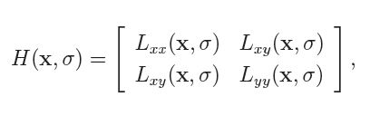
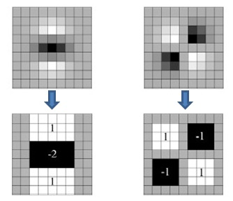
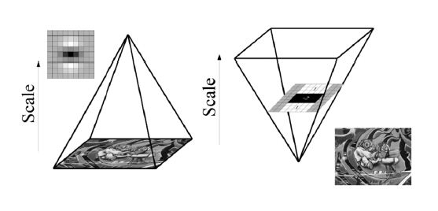
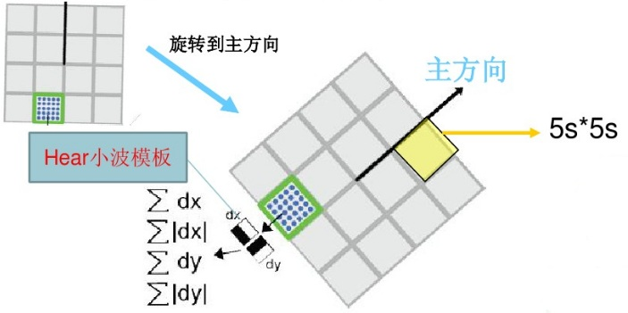

# SURF特征检测

## 1简介

Speeded Up Robust Features（SURF，加速稳健特征），是一种稳健的局部特征点检测和描述算法。最初由Herbert Bay发表在2006年的欧洲计算机视觉国际会议（Europen Conference on Computer Vision，ECCV）上，并在2008年正式发表在Computer Vision and Image Understanding期刊上。

Surf是对David Lowe在1999年提出的Sift算法的改进，提升了算法的执行效率，为算法在实时计算机视觉系统中应用提供了可能。与Sift算法一样，Surf算法的基本路程可以分为三大部分：局部特征点的提取、特征点的描述、特征点的匹配。

## 2 实现过程

Surf具体实现流程如下：

1. 构建Hessian（黑塞矩阵），生成所有的兴趣点，用于特征的提取；
2. 构建尺度空间;
3.  特征点定位;
4. 特征点主方向分配;
5. 生成特征点描述子;
6. 特征点匹配

### 2.1 构建Hessian

构建Hessian矩阵的目的是为了生成图像稳定的边缘点（突变点），跟Canny、拉普拉斯边缘检测的作用类似，为下文的特征提取做好基础。构建Hessian矩阵的过程对应于Sift算法中的高斯卷积过程。黑塞矩阵（Hessian Matrix）是一个多元函数的二阶偏导数构成的方阵，描述了函数的局部曲率。由德国数学家Ludwin Otto Hessian于19世纪提出。对一个图像f(x,y)其Hessian矩阵如下：

在构造Hessian矩阵前需要对图像进行高斯滤波，经过滤波后的Hessian矩阵表述为：

当Hessian矩阵的判别式取得局部极大值时，判定当前点是比周围邻域内其他点更亮或更暗的点，由此来定位关键点的位置。

离散数字图像中，一阶导数是相邻像素的灰度差：
$$
D_x = f(x+1,y) - f(x,y)
$$
二阶导数是对一阶导数的再次求导：
$$
D_{xx} = [f(x+1,y) - f(x,y)] - [f(x,y)-f(x-1,y)] = f(x+1,y) + f(x-1,y) - 2*f(x,y)
$$
反过来看Hessian矩阵的判别式，其实就是当前点水平方向二阶偏导乘以垂直方向的二阶偏导再减去当前点水平、垂直二阶偏导的二次方：
$$
det(H) = D_{xx}*D_{yy} - D_{xy} * D_{xy}
$$
Hessian矩阵判别式中的f(x,y)是原始图像的高斯卷积，由于高斯核实服从正态分布的，从中心点往外，系数越来越低，为了提高运算速度，Surf使用了盒式滤波器来近似替代高斯滤波器，所以在Dxy上乘了一个加权系数0.9，目的是为了平衡因使用盒式滤波器近似所带来的误差：实现的公式如下
$$
det(H) = D_{xx}*D_{yy} - (0.9*D_{yy})^2
$$
高斯滤波器和盒式滤波器的示意图如下：

上边两幅图是9*9高斯滤波器模板分别在图像上垂直方向上二阶导数Dyy和Dxy对应的值，下边两幅图是使用盒式滤波器对其近似，灰色部分的像素值为0，黑色为-2，白色为1。

那么为什么盒式滤波器可以提高运算速度呢，这就涉及到积分图的使用。盒式滤波器对图像的滤波转化成计算图像上不同区域间像素和的加减运算问题，这正是积分图的强项，只需要简单几次查找积分图就可以完成。

### 2.2 构建尺度空间

同Sift一样，Surf的尺度空间也是由O组L成组成，不同的是，Sift中下一组图像的尺寸是上一组的一半，同一组间图像尺寸一样，但是所使用的高斯模糊系数逐渐增大；而在Surf中，不同组间图像的尺寸都是一致的，不同的是不同组间使用的盒式滤波器的模板尺寸逐渐增大，同一组间不同层间使用相同尺寸的滤波器，但是滤波器的模糊系数逐渐增大，如下图所示：

### 2.3 特征点定位

特征点的定位过程Surf和Sift保持一致，将经过Hessian矩阵处理的每个像素点与二维图像空间和尺度空间邻域内的26个点进行比较，初步定位出关键点，再经过滤除能量比较弱的关键点以及错误定位的关键点，筛选出最终的稳定的特征点。也可以理解为获取局部最优的解.通过偏导接近最有的值.最后得到局部最优点,然后再反推出坐标.

### 2.4 特征点主方向分配

Sift特征点方向分配是采用在特征点邻域内统计其梯度直方图，取直方图bin值最大的以及超过最大bin值80%的那些方向作为特征点的主方向。而在Surf中，采用的是统计特征点圆形邻域内的harr小波特征。即在特征点的圆形邻域内，统计60度扇形内所有点的水平、垂直harr小波特征总和，然后扇形以0.2弧度大小的间隔进行旋转并再次统计该区域内harr小波特征值之后，最后将值最大的那个扇形的方向作为该特征点的主方向。该过程示意图如下：

### 2.5 生成特征点描述子

在Sift中，是取特征点周围4*4个区域块，统计每小块内8个梯度方向，用着4*4*8=128维向量作为Sift特征的描述子。

Surf算法中，也是在特征点周围取一个4*4的矩形区域块，但是所取得矩形区域方向是沿着特征点的主方向。每个子区域统计25个像素的水平方向和垂直方向的haar小波特征，这里的水平和垂直方向都是相对主方向而言的。该haar小波特征为水平方向值之后、垂直方向值之后、水平方向绝对值之后以及垂直方向绝对值之和4个方向。该过程示意图如下：

把这4个值作为每个子块区域的特征向量，所以一共有4*4*4=64维向量作为Surf特征的描述子，比Sift特征的描述子减少了2倍。

### 2.6 特征点匹配

与Sift特征点匹配类似，Surf也是通过计算两个特征点间的欧式距离来确定匹配度，欧氏距离越短，代表两个特征点的匹配度越好。不同的是Surf还加入了Hessian矩阵迹的判断，如果两个特征点的矩阵迹正负号相同，代表这两个特征具有相同方向上的对比度变化，如果不同，说明这两个特征点的对比度变化方向是相反的，即使欧氏距离为0，页直接予以排除。

## 3 OpenCV API与代码演示

详情的代码[在这](http://localhost:8888/notebooks/FeatureExtraction/CornerDetection/SURF/SURF.ipynb)可以看到．

## 参考文献

1. [Surf算法特征点检测与匹配](https://blog.csdn.net/dcrmg/article/details/52601010)

2. [SURF算法分析](https://wenku.baidu.com/view/1e0b33e3011ca300a6c390c1.html)
3. [OpenCV-Python sift/surf特征匹配与显示](https://blog.csdn.net/dcrmg/article/details/78817988)

