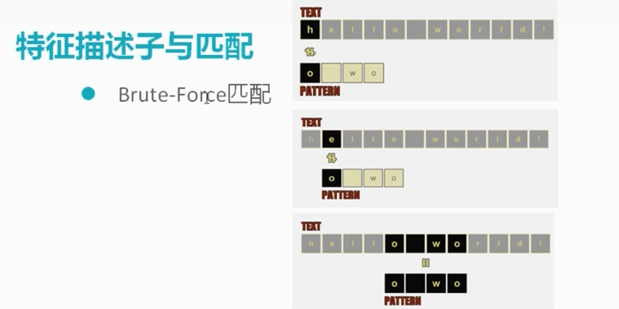

# 特征描述子

对于图像处理,再获取到特征描述子后可以对图像进行匹配.

## 1 特征描述子与匹配

- 什么是图像特征描述子:我们一般对图像进行识别的时候式做DDM.在进行检测的时候我们得到的是关键点, 然后获取到周围窗口的采样点.再进行归一化,得到描述子.对于一个大的图像,每一个窗口都有一个描述子,每个位置上都有个描述子.我们得到这些信息之后,就可以与另外一副图像进行匹配了.

## 1.1 匹配

用以下方法进行匹配,这个匹配的算法效率不是很高,但为了演示,所以用这个比较简单的算法进行讲解,如图所示.

## 2 代码演示

匹配两张图片

