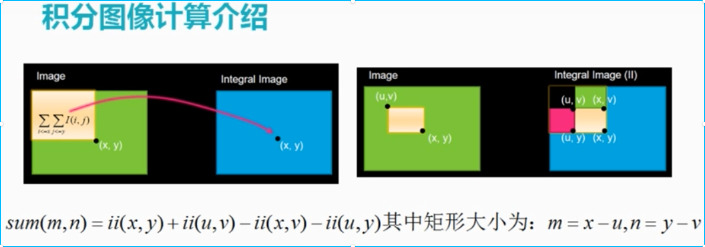
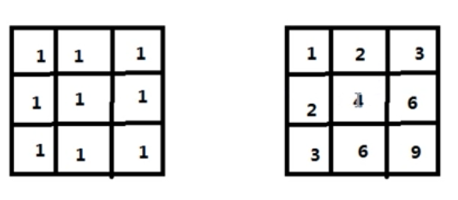
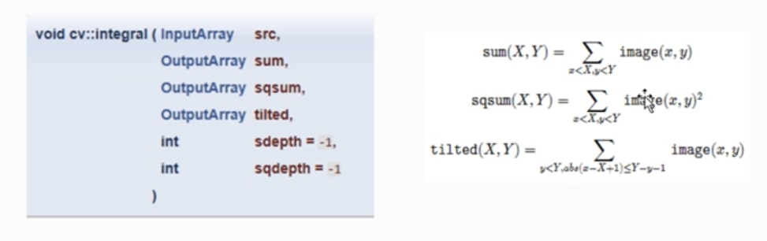

# 积分图计算

通过这个方式能够提高运算速度.

## 1 简介

如图所示





是左上角各个图像的总和而得到积分图.

- 当要求某一个像素或者区域时候,就可以通过查找表的方式查找,提过运算速度.

## 2 API说明



## 3 代码实现

```
#include <opencv2/opencv.hpp>
#include <iostream>

using namespace cv;

int main(int argc, char** argv) {
        Mat src = imread("D:/vcprojects/images/test.png", IMREAD_GRAYSCALE);
        if (src.empty()) {
                printf("could not load image...\n");
                return -1;
        }
        namedWindow("input image", CV_WINDOW_AUTOSIZE);
        imshow("input image", src);

        Mat sumii = Mat::zeros(src.rows + 1, src.cols + 1, CV_32FC1);
        Mat sqsumii = Mat::zeros(src.rows + 1, src.cols + 1, CV_64FC1);
        integral(src, sumii, sqsumii);

        Mat iiResult;
        normalize(sumii, iiResult, 0, 255, NORM_MINMAX, CV_8UC1, Mat());
        imshow("Integral Image", iiResult);

        waitKey(0);
        return 0;
}
                          
```


- 积分图是为后面做准备,可以提高计算速度.