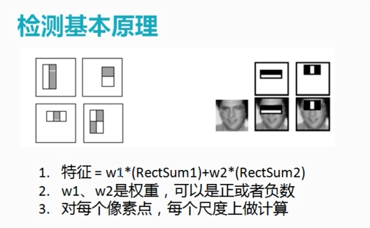
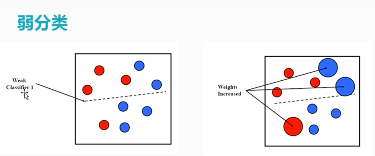
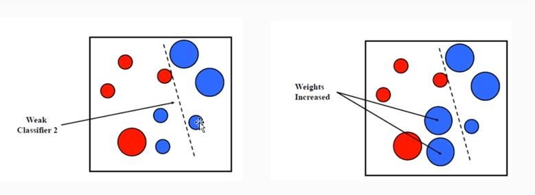
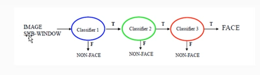

# 级联检测(人脸检测)

## 1 检测基本原理



分类器:



过程:



## 2 代码演示

```
#include <opencv2/opencv.hpp>
#include <iostream>

using namespace cv;
using namespace std;

int main(int argc, char** argv) {
        String cascadeFilePath = "D:/opencv3.1/opencv/build/etc/haarcascades/haarcascade_frontalface_alt.xml";
        CascadeClassifier face_cascade;
        if (!face_cascade.load(cascadeFilePath)) {
                printf("could not load haar data...\n");
                return -1;
        }
        Mat src, gray_src;
        src = imread("D:/vcprojects/images/test.png");
        cvtColor(src, gray_src, COLOR_BGR2GRAY);
        equalizeHist(gray_src, gray_src);
        imshow("input image", src);

        vector<Rect> faces;
        face_cascade.detectMultiScale(gray_src, faces, 1.1, 2, 0, Size(30, 30));
        for (size_t t = 0; t < faces.size(); t++) {
                rectangle(src, faces[t], Scalar(0, 0, 255), 2, 8, 0);
        }
        namedWindow("output", CV_WINDOW_AUTOSIZE);
        imshow("output", src);

        waitKey(0);
        return 0;
}
```

