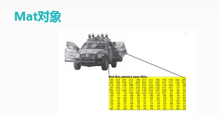
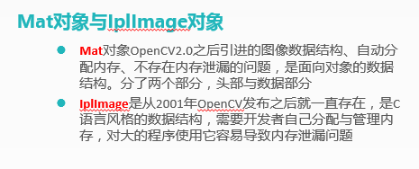
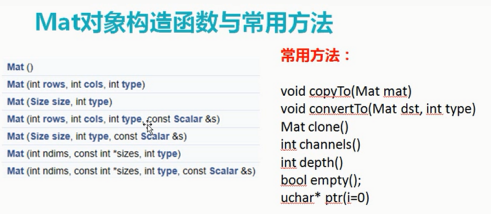
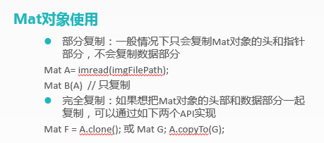
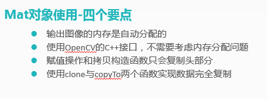
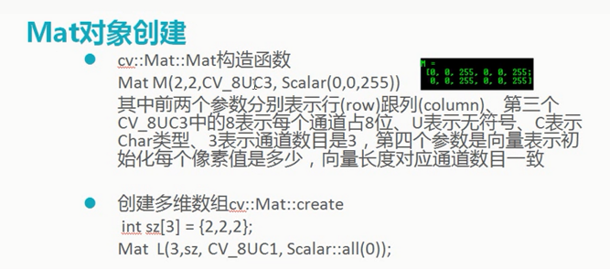
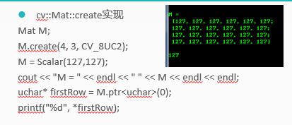
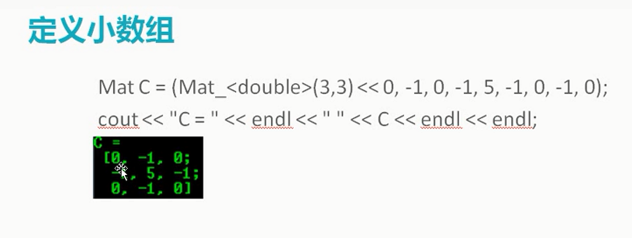

# Mat对象

- Mat对象与IplImage对象
- Mat对象
- Mat定义数组

对于Mat是用于存储图像数据的，在Python中相当于一个numpy数组，也是用于存放数据，可以对这个数组进行各种各样的操作。对于学习mat对象要知道获取该对象的行和列，还有通道数，还有如何创建mat等，这些的操作与Python中的numpy差不多，理解为numpy操作就很容易理解了。

## 1 Mat对象

如图所示，在人的眼中是一张图，在计算机眼中是一串数组，存放在Mat中。

### 1.2 Mat对象与IPIImage对象

### 1.3 Mat对象构造函数与常用方法

### 1.4 Mat对象使用

### 1.5 Mat对象四个要点

## 1.6 Mat对象创建

- 方式一

- 方式二：通过create函数创建

### 1.7 定义小数组

