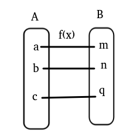

# 像素重映射

## 1 简介

- 什么是像素重映射

  简单说就是把输入图像中各个像素按照一定的规则映射到另一张图像的对应位置上去,形成一张新的图像.例如:

  

  

$$
g(x,y) = f(h(x,y))
$$

g(x,y)式重映射之后的 图像,h(x,y)式功能函数,f是源函数.例如通过映射函数图像映射得到的图像:通过一个函数映射得到

就是把像素按照一定的规则重新排.

## 2 Opencv API介绍

具体的API介绍在[代码演示部分](https://github.com/zhi-z/OpenCV/blob/master/OpenCV_Tutorial/OpenCV-Basic/%E5%83%8F%E7%B4%A0%E9%87%8D%E6%98%A0%E5%B0%84/mapping.ipynb).

## 参考文献

- [opencv学习(三十四)之重映射remap](https://blog.csdn.net/keith_bb/article/details/56295873)