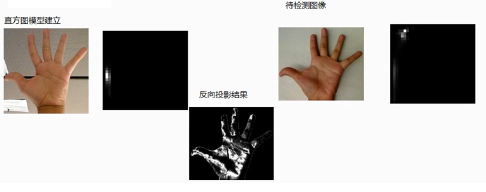

# 直方图反向投影(Back Projection)

## 1 概述

- 反向投影式反应直方图模型在目标图像中的分布情况
- 简单的说是用直方图模型取目标图像中寻找是否有相似的对象.通常用HSV色彩空间的HS两个通道直返图模型.

如图所示,我们使用肤色直方图为例来解释反向投影的工作原理:

假设你已经通过下图得到一个肤色直方图(Hue-Saturation)， 旁边的直方图就是 模型直方图 ( 代表手掌的皮肤色调).你可以通过掩码操作来抓取手掌所在区域的直方图,左边的手掌获取到直方图模型,另一张手掌图(测试图像) 以及对应的整张图像的直方图.我们要做的就是使用 模型直方图 (代表手掌的皮肤色调) 来检测测试图像中的皮肤区域。

所谓反向投影就是首先计算某一特征的直方图模型，然后使用模型去寻找图像中存在的该特征。”

## 2 步骤

1. 建立直方图模型
2. 计算待测待测图像直方图并映射到模型中
3. 从模型反向计算生成图像 

## 3 使用Opencv实现的步骤与API

1. 加载图片imread
2. 将图像从RGB色彩空间转换到HSV色彩空间CVColor
3. 计算直方图和归一化calcHist与normalize
4. Mat与MatNB其中Mat表示二维数组,MatND表示三维或者多维数据,此处均可以用Mat表示
5. 计算反向投影图像-calcBackPAroject

## 参考文献

- [反向投影backproject的直观理解](https://blog.csdn.net/viewcode/article/details/8209067)
- [反向投影](http://www.opencv.org.cn/opencvdoc/2.3.2/html/doc/tutorials/imgproc/histograms/back_projection/back_projection.html#back-projection)
- [opencv 直方图反向投影](http://www.cnblogs.com/zsb517/archive/2012/06/20/2556508.html)

