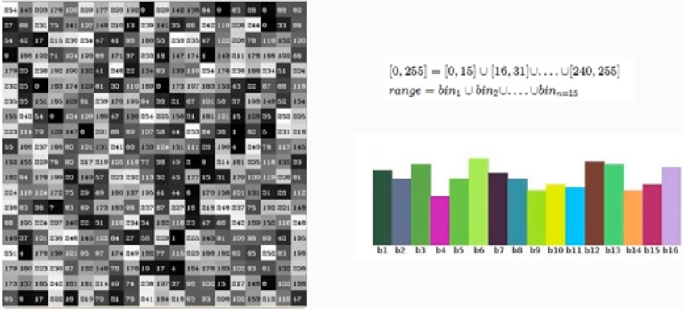

# 直方图计算

## 1 直方图概念

这个是一个通道的灰度图，按照一定的范围分等级的绘制直方图．

上述的直方图式基于图像像素值，其实对图像梯度＼每个像素的角度等一切像素的属性值，气门都可以建立直方图．这才是真正意义的直方图概念．不过基于图像像素灰度直直方图式最常见的．

- 直方图常见的几个属性

  - dims表示维度：对灰度图像来说只有一个通道值dims=1
  - bins表示在维度中子区域大小划分，bins=256，划分为256个级别
  - range表示取值的范围，灰度值范围为[0~255]之间

  

## 2 API学习与代码演示

